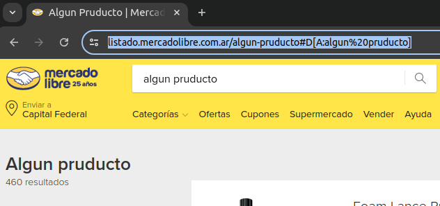

# Challenge: WebScraping whith Selenium (CaféIT)

Target:
- https://www.mercadolibre.com.ar

## Goal:
Retrieve 120 search results of the following keywords
>  ---
> - **navajas**
> - **chocolates bonafine**
> - **guantes everlast**
> - **doble pedal batería acustica**
>  ---
Each result subset must contain:
- The 60 cheapest products
- The 60 most expensive products
>  ---

Save results as
- ***"output.json"***
- ***"output.csv"***

Example of **output.json**:
```py
{
    <MLA_ID>: {
        "keywords": <str>,
        "MLA_ID": <str>,
        "product_name": <str>,
        "price": <float>,
        "url": <str>
    },
    # ...
    <MLA_ID>: {
        "keywords": <str>,
        "MLA_ID": <str>,
        "product_name": <str>,
        "price": <float>,
        "url": <str>
    }
}
```

> - https://articulo.mercadolibre.com.ar/MLA-1420993743-pedales-de-bombo-doble-para-baterias-acustica-y-electronica-_JM
```py
{
    "1420993743": {
        "keywords": "doble pedal batería acustica",
        "product_name": "Pedales De Bombo Doble Para Baterias Acustica Y Electronica,
        "price": 618999.00,
        "url": "https://articulo.mercadolibre.com.ar/MLA-1420993743-pedales-de-bombo-doble-para-baterias-acustica-y-electronica-_JM"
    }
}
```
Example of **output.csv**:
| MLA_ID | keywords | product_name | price | url |
|---|---|---|---|---|
| 1420993743 | doble pedal batería acustica | Pedales De Bombo Doble Para Baterias Acustica Y Electronica | 618999.00 | https://articulo.mercadolibre.com.ar/MLA-1420993743-pedales-de-bombo-doble-para-baterias-acustica-y-electronica-_JM |


---
## Technical restrictions:

- Python +3.6
- [virtualenv](https://pypi.org/project/virtualenv/):
```shell
# https://pypi.org/project/virtualenv/
>$ pip install virtualenv
```
- Dependencies:
```shell
# /requirements.txt
selenium==4.24.0
webdriver-manager==4.0.2
```

```shell
# Create a virtual environment
$ python3 -m venv env
# Activate (on linux)
$ source env/bin/activate
# Install dependences
$ (env) pip install -r requirements.txt
```
- **Locate WebElements only with `driver.find_element(By.XPATH,some_xpath)` or `driver.find_elements(By.ID, some_id)`**
  - See more in `https://selenium-python.readthedocs.io/locating-elements.html`
  - Example of use: [wikipedia_example.py](wikipedia_example.py)
  - About XPATH: https://www.tutorialspoint.com/xpath/xpath_quick_guide.htm

---
# NOTE
It is not necessary to replicate all the actions you would do in the browser.
E.g:
> If you search for the key words "Algun producto", the website redirects to https://listado.mercadolibre.com.ar/algun-pruducto#D[A:algun%20pruducto]
> > 


```py
# You only need
LIST_URL = "https://listado.mercadolibre.com.ar/"
key_words = "algun-pruducto"
url = LIST_URL + key_words
driver.get(url)
```

